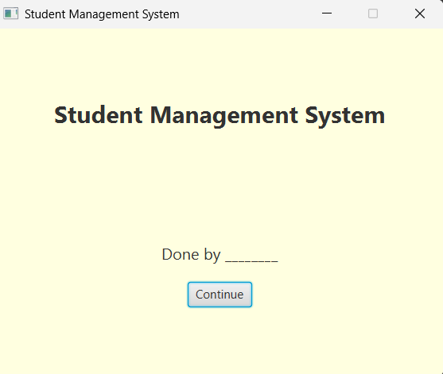
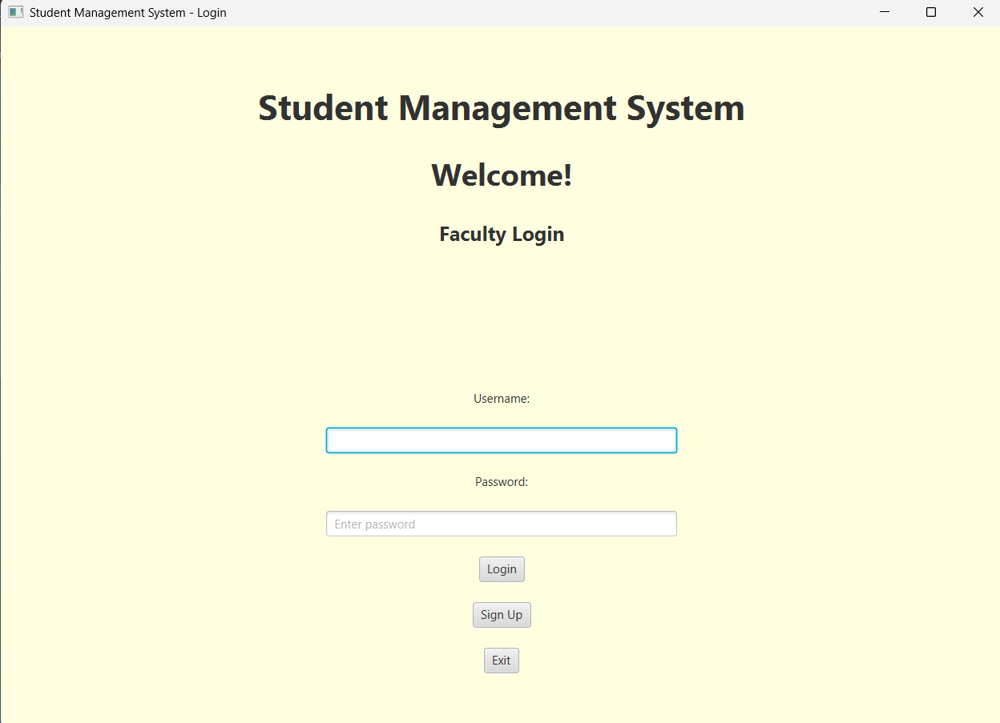
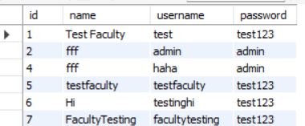
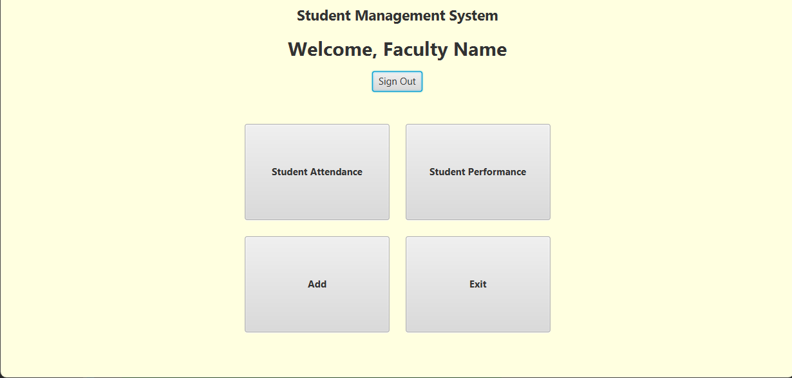

# 🎓 StudentManagementSystem

A **JavaFX + MySQL** desktop app to manage student records, attendance, and marks — perfect for academic projects.

---

## ✨ Features

- 👩‍🏫 Faculty login/signup system  
- 🎓 Student registration  
- 📚 Course and subject management  
- 🗓️ Attendance tracking with percentage analysis  
- 🧪 Internal marks storage  
- 📊 Dynamic table views with dropdown filters (Course, Branch, Year of Joining)

---

## 🔧 Technologies Used

- Java
- JavaFX
- JDBC (Java Database Connectivity)
- MySQL
- JasperReports (optional)

Built using Java and connected to a MySQL database via JDBC, it ensures reliable and secure data operations. The UI is built using JavaFX, providing an intuitive and user-friendly experience. Optional integration with JasperReports allows for professional report generation.

The system is modular and scalable, suitable for institutions managing a large number of student records. It includes features that allow faculty to mark attendance per period, calculate attendance percentages automatically, and store or retrieve marks with ease.

---

## 🚀 Setup & Usage

This project can be used for **college mini projects** or academic demos.  
Just configure your MySQL credentials (`URL`, `username`, `password`) in the source files, and the system is ready to use.

---

## ⚙️ Requirements

- JDK 8 or above  
- MySQL Server  
- Eclipse or any Java IDE  

---

## 💡 Quick Start

```bash
# Clone this repository
git clone https://github.com/hasss04/StudentManagementSystem.git

# Import into Eclipse
# Configure database credentials in code

# Run the application
Run Main.java
```

---

## 📸 Screenshots

### 👋 Welcome Screen  


### 🔐 Faculty Login Screen  


### 🗃️ Faculty Details Stored in Database  


### 🏡 Home Screen After Successful Login  



---

## 📁 Project Structure

```
StudentManagementSystem/
├── src/
│   └── StudentManagement/
│       ├── AddCourse.java
│       ├── AddStudent.java
│       ├── AddSubject.java
│       ├── DatabaseTest.java
│       ├── EnterMark.java
│       ├── HomePage.java
│       ├── LoginPage.java
│       ├── Main.java
│       ├── SignUpPage.java
│       ├── StudentAttendance.java
│       ├── StudentPerformance.java
│       ├── Studentinfo.java
│       ├── logo1.png
│       ├── screenshot_home.png
│       └── screenshot_login.png
├── README.md
├── student_info.pdf
```

---

## 📄 License

This project is for educational purposes only.
